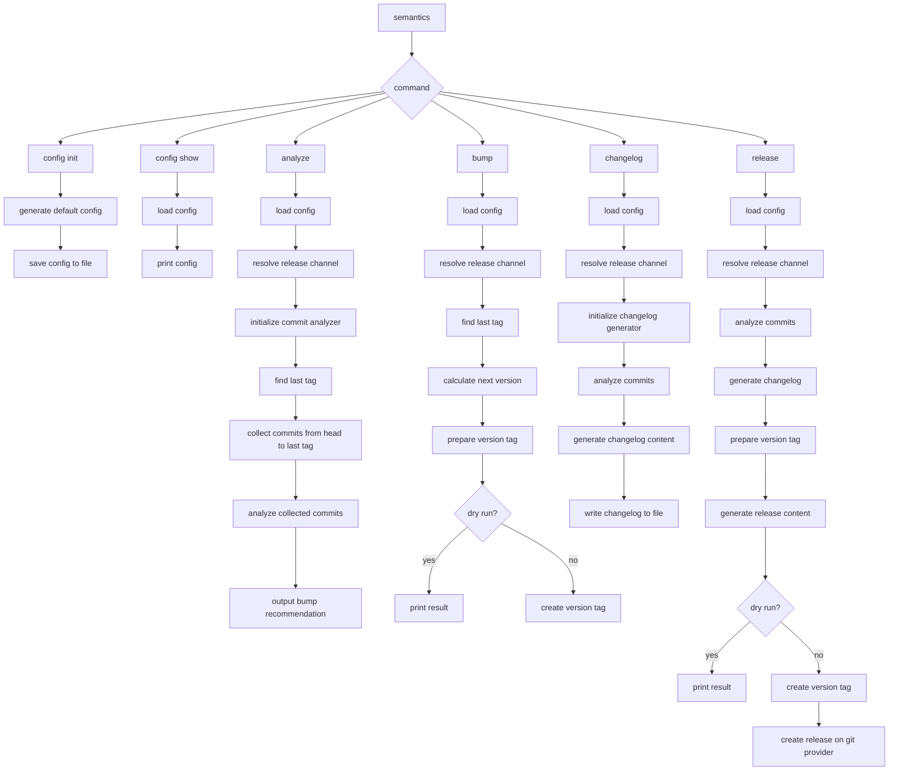

```mermaid
flowchart TD
  %% Declare entities
  cli[semantics <command>]
  cmd{command}

  %% Commands
  config_init[config init]
  config_show[config show]
  analyze[analyze]
  bump[bump]
  changelog[changelog]
  release[release]

  %% Config initialization flow
  config_init_generate[generate default config]
  config_init_save[save config to file]

  %% Config show flow
  config_show_load[load config]
  config_show_print[print config]

  %% Analyze flow
  analyze_load[load config]
  analyze_resolve[resolve release channel]
  analyze_init[initialize commit analyzer]
  analyze_find[find last tag]
  analyze_collect[collect commits from head to last tag]
  analyze_analyze[analyze collected commits]
  analyze_output[output bump recommendation]

  %% Bump flow
  bump_load[load config]
  bump_resolve[resolve release channel]
  bump_find[find last tag]
  bump_calc[calculate next version]
  bump_tag[prepare version tag]
  bump_dry{dry run?}
  bump_print[print result]
  bump_write[create version tag]

  %% Changelog flow
  changelog_load[load config]
  changelog_resolve[resolve release channel]
  changelog_init[initialize changelog generator]
  changelog_analyze[analyze commits]
  changelog_generate[generate changelog content]
  changelog_write[write changelog to file]

  %% Release flow
  release_load[load config]
  release_resolve[resolve release channel]
  release_analyze[analyze commits]
  release_changelog[generate changelog]
  release_tag[prepare version tag]
  release_dry{dry run?}
  release_print[print result]
  release_write[create version tag]
  release_generate[generate release content]
  release_create[create release on git provider]

  %% Define flows
  cli --> cmd
  cmd --> config_init
  cmd --> config_show
  cmd --> analyze
  cmd --> bump
  cmd --> changelog
  cmd --> release

  config_init --> config_init_generate
  config_init_generate --> config_init_save

  config_show --> config_show_load
  config_show_load --> config_show_print

  analyze --> analyze_load
  analyze_load --> analyze_resolve
  analyze_resolve --> analyze_init
  analyze_init --> analyze_find
  analyze_find --> analyze_collect
  analyze_collect --> analyze_analyze
  analyze_analyze --> analyze_output

  bump --> bump_load
  bump_load --> bump_resolve
  bump_resolve --> bump_find
  bump_find --> bump_calc
  bump_calc --> bump_tag
  bump_tag --> bump_dry
  bump_dry -->|yes| bump_print
  bump_dry -->|no| bump_write

  changelog --> changelog_load
  changelog_load --> changelog_resolve
  changelog_resolve --> changelog_init
  changelog_init --> changelog_analyze
  changelog_analyze --> changelog_generate
  changelog_generate --> changelog_write

  release --> release_load
  release_load --> release_resolve
  release_resolve --> release_analyze
  release_analyze --> release_changelog
  release_changelog --> release_tag
  release_tag --> release_generate
  release_generate --> release_dry
  release_dry -->|yes| release_print
  release_dry -->|no| release_write
  release_write --> release_create
```
